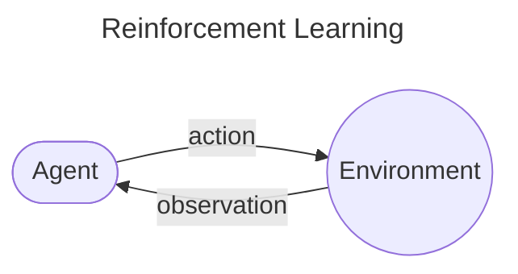

# Reinforcement Learning

[Deepmind X UCL Youtube Course](https://youtu.be/aQJP3Z2Ho8U?si=XIrM9J_7FHwvsfbY)

# CH1 Introduction

An AI Agent does the following:
**Make Decision** based on **Understanding of the World** in order to **Achieve Goal**

* Understand The World: Model The Environment as states and actions. Sometimes also prediction.
* Achieve Goal: Reward / Penalty based on states and delay (long-short term).
* Make Decision: Polciy maps a state, observation to an action.

## What is reinforcment Learning?
```
The science and framework of learning to make decisions from interaction
```
Agent interacts with the environment (through observation and reward signal) and learn to maximize the reward.

> [!NOTE]
> **Reward Hypothese:** <br>
> Any goal can be formalized as the outcome of maximizing a cumulated reward

## Problem Formalization


* **Agent**:
At each step t the agent receives observation $O_t$ (and reward $R_t$) and executes action $A_t$.
* **Environment**:
At each state t the enviornment receives action $A_t$ and emits observation $O_{t+1}$ (and reward $R_{t+1}$)
* **Reward**:
A Scalar signal specifies the goal $R_t$

### Formalism
* Observation: $O_t$
* Action: $A_t$ (may have long term consequences)
* Rewrad: $R_t$  (Reward may be delayed, can sacrifice immediate rward to gain long-term reward)


* Goal: $G_t = R_{t+1} + R_{t+2} + R_{t+3} + \ldots$
* Value: The expected cumulative reward from a state s
$$
\begin{align}
v(s) &= \mathbb{E} \left[ G_t \mid S_t = s \right] \\
     &= \mathbb{E} \left[ R_{t+1} + R_{t+2} + R_{t+3} + \ldots \mid S_t = s \right]
\end{align}
$$

Note: $\mathbb{E}\left[ X \right]$ means "expected value of X"

* Policy: A mapping from state to actions (select actions to maximise value)

## Inside The Agent:
* Agent State:
  * Observability: environment state != avent state
  * History: sequence of observation, action and reward <br> $\mathcal{H}_t = O_0, A_0, R_1, O_1, \ldots, O_{t-1}, A_{t-1}, R_t, O_t$

  * The history is used to construc the agent state $S_t$ (Markov assumption)
  * Update function $u$ : Agent state is a function of the history $S_{t+1} = u(S_t, A_t, R_{t+1}, O_{t+1})$
* Policy:
  * Mapping between state and action $pi$
  * $\pi(A \mid S) = p(A \mid S)$
* Value Functions
  * Value function is used to select between actions
  * Can have discount factor $\gamma \in [0, 1]$
  * $v_\pi(s) = \mathbb{E}\left[R_{t+1} + \gamma R_{t+2} + \gamma^2 R_{t+3} + \ldots \mid S_t = s, \pi \right]$
* Model
  *  Predicts what the environment will do next (next state and/or next reward)
  * Predict State: $\mathcal{P}(s, a, s') \approx p(S_{t+1} = s' \mid S_t = s, A_t = a)$
  * Predict Reward: $\mathcal{R}(s, a) \approx \mathbb{E} \left[ R_{t+1} \mid S_t = s, A_t = a \right]$

## Subproblems of the RL Problem:

Reinforcement can be divide as the following subproblems:

### Prediction and Control
* Prediction: evaluate the future (for a given policy)
* Control: optimize the future (find the best policy)

### Learing and Planning
* Learning:
  * The environment is initially unknown
  * The agent interacts with the environment
* A model of the environment is given (or learnt)
  * The agent plans in this model (without external interaction)
  * a.k.a. reasoning, pondering, thought, search, planning


